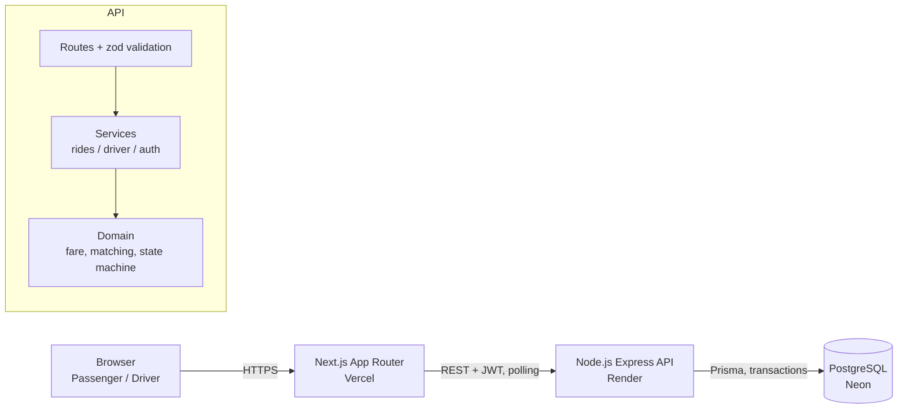

# Architecture

## Overview

## Components

- **Web (Next.js, App Router, TypeScript, Tailwind)**: separate passenger and driver areas. Uses SWR with polling (every few seconds) to reflect ride/pool status without a WebSocket server.
- **API (Express, TypeScript)**: REST endpoints under `/api`. Requests are validated with zod, authenticated with a JWT bearer token, and routed to services.
  - **Routes**: parse and validate input, enforce auth/role middleware.
  - **Services**: orchestrate a request (e.g. create a ride, accept a pool), call domain logic, and persist through Prisma.
  - **Domain** (`fare.ts`, `zones.ts`, `matching.ts`, `stateMachine.ts`): pure functions with no DB access, so the fare formula, distance rule, matching compatibility rule, and lifecycle transitions can be unit tested in isolation.
- **Database (PostgreSQL)**: source of truth for users, vehicles, zones, ride requests, pools, pool memberships, ride events (audit log) and payments. Capacity and status invariants are enforced with CHECK constraints and partial unique indexes, not just application code.

## Why this shape

- Domain logic is separated from Express and Prisma so the fare/matching/state-machine rules can be tested without a running server or database.
- The seat-claim race (two passengers requesting the last seat at the same time) is resolved with a single atomic conditional `UPDATE` guarded by a CHECK constraint, not a read-then-write in JavaScript — see the concurrency section in the README for the exact statement and why it's safe under concurrent requests.
- Polling via SWR is a deliberate trade-off for an MVP: no WebSocket infrastructure to run or scale, at the cost of up-to-a-few-seconds latency on status updates.
