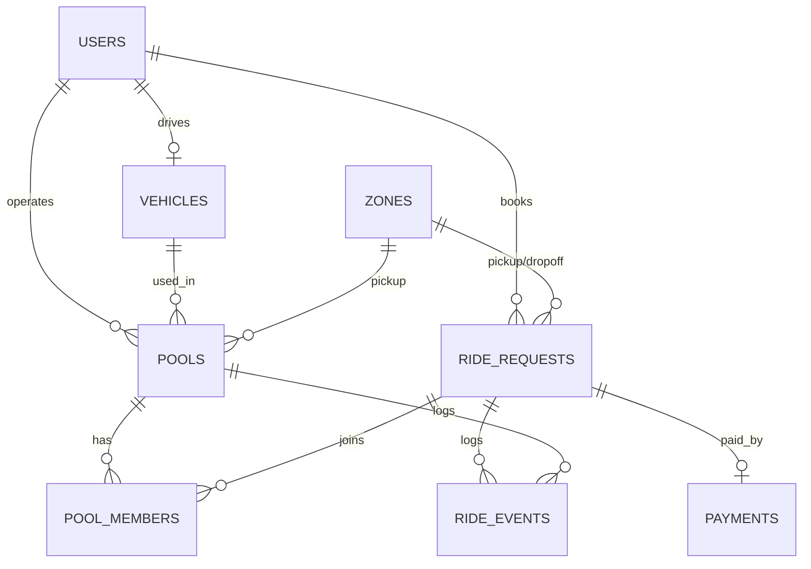

# Entity Relationship Diagram

## Table explanations

- **users**: both roles (passenger and driver) in one table with a shared auth path; `role` decides which API surface is allowed.
- **vehicles**: 1:1 with a driver (`driver_id` is UNIQUE). `capacity` is fixed per vehicle; `is_online` marks whether the Tesla is available for matching.
- **zones**: reference data (fixed Dhaka zones with integer grid coordinates). Ride pickup/dropoff are foreign keys into this table, so there are no free-text zone typos and distance can be computed from coordinates.
- **ride_requests**: one passenger's booking — pickup/dropoff zone, seats requested, individual fare, and status (`REQUESTED` → `MATCHED` → `IN_PROGRESS` → `COMPLETED`, or `CANCELLED`).
- **pools**: one physical trip of one Tesla — driver, vehicle, pickup zone, status (`ACCEPTED` → `DRIVER_ARRIVED` → `STARTED` → `COMPLETED`, or `CANCELLED`). `capacity` is snapshotted from the vehicle so the in-row CHECK constraint is self-contained; `seats_occupied` is a denormalized counter protected by that CHECK and only ever updated through an atomic conditional `UPDATE`.
- **pool_members**: many-to-many history between pools and ride requests. `left_at IS NULL` marks an active membership (a passenger can leave a pool and later join a different one, and the history is preserved).
- **ride_events**: append-only audit log of state transitions, so the exact sequence of what happened to a request or pool can be reconstructed.
- **payments**: one row per completed ride, either `CASH` or `TESLAPAY` wallet, with a status (`PAID` or `FAILED`, falling back to cash on insufficient wallet balance).

## Key constraints (beyond foreign keys)

- `vehicles.capacity` between 1 and 6; `pools.seats_occupied` between 0 and `capacity`.
- `ride_requests.seats` between 1 and 3; `pickup_zone_id <> dropoff_zone_id`.
- All fare/wallet amounts (stored as integer paisa) are `>= 0`.
- Partial unique indexes enforce: one active ride request per passenger, one active pool per driver, one active membership per ride request (all scoped to `WHERE left_at IS NULL` / active status).
